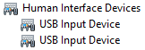

# VMwareHardenedLoader residual vulnerabilities

## About & Credit
Sanitized audit findings from isolated-lab testing — research and defensive purposes only. No PoCs.
**Fork of:** [hzqst/VmwareHardenedLoader](https://github.com/hzqst/VmwareHardenedLoader)

## Purpose
The purpose of this repo is to document remaining traces of a VM post-spoof. It's intended use is to be used as a template for security research and defensive analysis. This does not cover all possible remaining traces, it focuses on the common, easily identifiable traces that exist post-spoofing when using the upstream repo's guide. All testing was performed in isolated lab environments and no exploit code or PoCs are included.

## Scope
All testing was done on a Windows 10 22H2 Virtual Machine, following the upstream repository's instructions.

### Information:
- VM OS: Microsoft Windows 10 Pro 22H2 19045.3803
- Host OS: Microsoft Windows 10 Pro 22H2 19045.6456
- VMware Workstation v7.6.4-24832109

___

# **Findings**

| Vulnerability | Location | Photo| Notes| Extra Photo |
| --------------| -------- | ---- | ---- | ----------- |
| Unusually low number of Human Interface Devices             | Device Manager        |     | No regular machine has such a low amount of HIDs. Here is an image of a fresh windows 10 install for reference. | 
| Recent 'Device Started' Timestamp             | Device Manager (Events tab for a device)        |     | When all devices have the same timestamp/very slightly varied, it is usually an indicative of a VM if the timestamp is recent. | N/A
| Wrong Driver Provider             | Device Manager        |     | A photo of my fresh install PC for reference. | 
| Virtualisation Drivers while CPU is stated to be incapable of virtualisation             | C:\Windows\System32\drivers        |     | When a system is incapable of virtualisation, yet has a number of virtualisation-related drivers, it can be an indicator of a spoofed VM. | 
| BIOS Version/Date             | System Information        |     |
| Display Adapter Type             | System Information -> Components -> Adapter Type        |     |
| PNP Device ID "VMW" (VMware)             | System Information -> Components -> PNP Device ID        |     |
| Virtual Monitor Manager (+ no version or manufacturer info)             | Software Environments -> Loaded Modules        |     |

___

## **Analysis & Interpretation**
The collected artifacts show that even after following the full spoofing guide from the upstream repository, numerous identifiable traces of virtualization remain. The residual indicators range from inconsistencies in hardware, as well as driver and timestamp anomalies.

### General Overview
Post spoof, the system presents itself as a regular windows 10 installation, but a closer look reveals a number of discrepencies and mismatches that collectively udnermine the effectiveness of the spoof. These findings indicate that VMware's and Windows' internal device management still expose patterns unique to virtualized machines.

### 1. Anomalies in Hardware Enumeration
The low number of HIDs is one of the clearest signs which are not software-based. Physical systems normally enumerate multiple HID entries for controllers of keyboards, mice, touchpads, and additional I/O interfaces, while virtual environments pack many of these into a single layer, causing an unusually small HID list. This remains a **medium-confidence indicator** of virtualisation.

### 2. Temporal Consistency
Identical, or near identical "Device Started" timestamps across system components hint that devices were initialized simultaneously during the same session, which is a pattern not commonly observed on a real machine, where drivers and devices initialize over time due to software and driver updates, as well as hardware upgrades. This is a **moderate-strength indicator**, as while it is not exclusive to virtual environments, it is a strong context clue when paired with other findings.

### 3. Driver Provider Mismatch
The mismatch in driver provider names (such as VMware or unidentified providers appearing where Microsoft or OEMs should) suggests remnant virtualization-related drivers which were not fully hid. All of these inconsistencies presist even after following the spoofing guide just as instructed. **High-confidence indicator** because legitimate computers rarely ever show this combination.

### Virtualization Drivers and CPU Capability Mismatch
One of the most reliable traces observed is the coexistence of virtualization-related drivers (e.g. `vmgid.sys`, `vmouse.sys`, `vm3dmp.sys`) while the CPU reports it does not support virtualization. This contradiction strongly suggests the system is spoofed rather than being a genuine physical host. Therefore this is a **high-confidence indicator** of a VM post-spoof.

### System Information Artifacts
A number of entries in System Information (`msinfo32`) still leak virtual machine details such as:
- BIOS Version or Date fields tend to remain synthetic and/or generic
- Display Adapter Type can expose VMware or SVGA3D identifiers
- PNP Device IDs containing `VMW` directly correlate to VMware hardware emulation
These artifacts are consistent and easily detectable using basic system queries, representing a **high-confidence indicator**.

### Loaded Module Metadata
The appearance of `virtualmonitormanager.sys` under Loaded Modules, often lacking version and manufacturer metadata, hints towards the presence of a virtual environment. `virtualmonitormanager.sys` is a system file associated with virtualization technology. More specifically, it is a part of the *VMware tools*. This detail is interesting because at no point during the controlled testing was the VMware Tools package installed. This is a **medium-confidence indicator**, but is most effective when paired with other virtualization indicators.

____

# Summary of Findings
Despite following the upstream repository's instructions, the spoofed VM still exposes detectable traces across a range of different system layers. While no single indicator definitely proves a virtual environment, the **aggregate pattern** makes reliable detection feasible even post-spoof. This shows the limitations of spoofing techniques on the user level against an anti-VM analysis.

# Next Steps
I have included a Powershell script that attempts to detect residual indicators and signs of virtualization on a system that has undergone VM spoofing. The purpose of this script is to help identify artifacts and inconsistencies that may reveal the presence of a virtualized environment even after obfuscation techniques. The script performs a number of layered checks including:
- Hardware and device enumeration (i.e. HIDs)
- BIOS and firmware validation, checkiing for known strings of virtualization vendors such as `VMware` or `VirtualBox`
- Driver and log analysis, searching for virtualization related drivers while the CPU is stated to be incapable of virtualization (e.g. `vm*.sys`) and entries in `setupapi.dev.log`.
- Monitor and video controllers, identifying generic or missing monitor metadata often found in virtual machines.
- CPU virtualization capability cross checked with suspicious drivers.
- Timing Checks (can be prone to false flags)

At the top of the script, you can toggle debug mode on or off (1 or 0). If on, it will display the results of each test. If off, it will simply only dispay the final score and virtual environment risk.

